# ARSW-kafka-event-driven
Laboratorio de Apache Kafka y Arquitecturas Orientadas por Eventos para el curso ARSW (Arquitecturas de Software). Este repositorio contiene la implementación, ejemplos y ejercicios relacionados con la construcción de sistemas distribuidos basados en eventos utilizando Apache Kafka.

---
## Integrantes

- Andres Cardozo
- Juan David Gomez

---

## Actividad 1 — Análisis de comunicación (Cap. 1)

> Para una tienda en línea, clasifique qué procesos deberían ser síncronos, asíncronos o híbridos:
> consultar productos, crear pedido, validar pago, enviar notificación, actualizar analítica y registrar auditoría.
> Justifique brevemente su decisión.

| Proceso               | Tipo       | Justificación |
|-----------------------|------------|---------------|
| Consultar productos   | Síncrono   | El usuario espera la respuesta de inmediato para continuar navegando. No hay procesamiento posterior ni múltiples consumidores involucrados. |
| Crear pedido          | Híbrido    | La confirmación al usuario es síncrona (el cliente necesita saber que su pedido fue recibido), pero la cadena resultante (pago, inventario, notificación) se propaga de forma asíncrona. |
| Validar pago          | Híbrido    | La consulta inicial al gateway puede requerir respuesta inmediata para informar al usuario, pero el resultado dispara procesos asíncronos posteriores (facturación, reserva de inventario, notificación). |
| Enviar notificación   | Asíncrono  | No requiere respuesta inmediata ni bloquea el flujo principal. Se ejecuta en segundo plano; un fallo en la notificación no debe afectar la creación del pedido. |
| Actualizar analítica  | Asíncrono  | No necesita respuesta inmediata ni debe bloquear el flujo de negocio. Puede procesarse en diferido, soporta alto volumen y se beneficia del reprocesamiento. |
| Registrar auditoría   | Asíncrono  | Debe ocurrir sin bloquear el flujo principal. No requiere respuesta al usuario y se beneficia del reprocesamiento ante fallos o revisiones posteriores. |

### Conclusión

Los procesos que **impactan directamente la experiencia inmediata del usuario** (consultar, confirmar) deben ser síncronos. Los procesos de **soporte y consecuencias del negocio** (notificaciones, analítica, auditoría) son naturalmente asíncronos. Los procesos **core de negocio** como crear pedido y validar pago son híbridos: tienen una parte síncrona orientada al usuario y una parte asíncrona orientada a los sistemas internos.

---


## Actividad 2 — Decisiones de configuración (Cap. 2)

> Analice una configuración con un topic `orders`, una partición, factor de replicación 1, mensajes sin clave
> y retención de 24 horas. Identifique riesgos y proponga mejoras para un ambiente productivo.

### Configuración analizada

| Parámetro             | Valor actual |
|-----------------------|--------------|
| Topic                 | `orders`     |
| Particiones           | 1            |
| Factor de replicación | 1            |
| Clave de mensaje      | Ninguna      |
| Retención             | 24 horas     |

### Riesgos identificados

| Parámetro             | Riesgo                                                                                                                                                                                   | Atributo afectado            |
|-----------------------|------------------------------------------------------------------------------------------------------------------------------------------------------------------------------------------|------------------------------|
| 1 partición           | Solo un consumidor del grupo puede procesar mensajes en paralelo. Ante alto volumen de pedidos se convierte en un cuello de botella irrecuperable sin rediseño del topic.               | Escalabilidad                |
| Replicación 1         | Si el único broker falla, todos los eventos del topic se pierden permanentemente. No existe ninguna réplica de respaldo ni ISR.                                                          | Disponibilidad / Durabilidad |
| Sin clave             | Los mensajes se distribuyen en round-robin. Si en el futuro se agregan particiones, eventos del mismo pedido pueden quedar en particiones distintas, rompiendo el orden por `orderId`.   | Consistencia                 |
| Retención 24 horas    | Si un consumidor cae por más de 24 horas (incidente, mantenimiento), los eventos se pierden sin posibilidad de reprocesamiento. Tampoco es viable para analítica histórica ni auditoría. | Confiabilidad / Trazabilidad |

### Propuesta de mejoras para producción

| Parámetro             | Valor actual | Valor propuesto | Justificación |
|-----------------------|--------------|-----------------|---------------|
| Particiones           | 1            | 3               | Permite que hasta 3 consumidores del mismo grupo trabajen en paralelo, aumentando el throughput y habilitando escalabilidad horizontal. |
| Factor de replicación | 1            | 3               | Tolera la caída de hasta 2 brokers sin pérdida de datos. Se recomienda además `min.insync.replicas=2` para que al menos 2 réplicas confirmen cada escritura. |
| Clave de mensaje      | Ninguna      | `orderId`       | Garantiza que todos los eventos de un mismo pedido lleguen a la misma partición, preservando su orden cronológico. |
| Retención             | 24 horas     | 7 días          | Permite recuperar consumidores caídos, habilita reprocesamiento ante errores y soporta analítica e auditoría histórica. |

### Conclusión

Esta configuración es aceptable en un entorno local de laboratorio pero inapropiada para producción. Los riesgos principales son la pérdida total de datos ante fallo del broker (replicación 1), la incapacidad de escalar el procesamiento (1 partición) y la pérdida irreversible de eventos ante caídas de consumidores superiores a 24 horas. Las mejoras propuestas abordan directamente los atributos de escalabilidad, disponibilidad, confiabilidad y trazabilidad.

---

## Actividad 3 — Entorno de laboratorio (Cap. 3)

> Cree los topics `orders`, `payments` e `inventory`. Publique al menos cinco eventos JSON
> y verifique en Kafka UI el topic, partición, offset, clave y contenido.

### Levantar el entorno

```bash
docker compose up -d
docker ps
```

Kafka UI disponible en [http://localhost:8080](http://localhost:8080). Broker expuesto en `localhost:9092`.

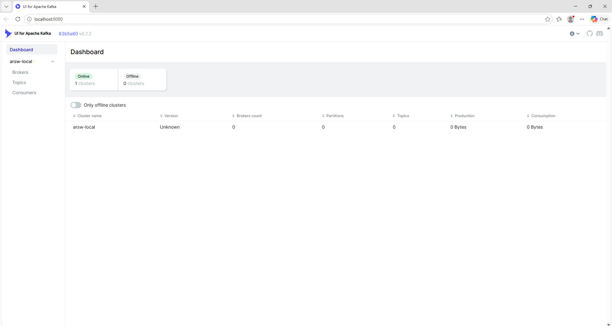

### Crear los topics

```
docker exec -it arsw-kafka bash

/opt/kafka/bin/kafka-topics.sh --create --topic orders \
  --bootstrap-server localhost:9092 --partitions 3 --replication-factor 1

/opt/kafka/bin/kafka-topics.sh --create --topic payments \
  --bootstrap-server localhost:9092 --partitions 3 --replication-factor 1

/opt/kafka/bin/kafka-topics.sh --create --topic inventory \
  --bootstrap-server localhost:9092 --partitions 3 --replication-factor 1


/opt/kafka/bin/kafka-topics.sh --list --bootstrap-server localhost:9092
```

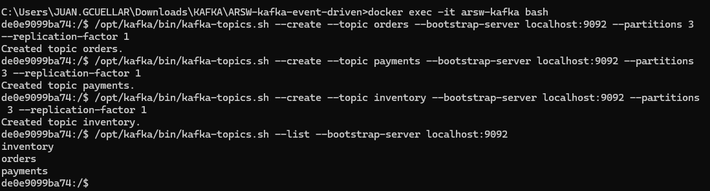

### Publicar eventos JSON

**Topic `orders`:**

```
/opt/kafka/bin/kafka-console-producer.sh --topic orders \
  --bootstrap-server localhost:9092 \
  --property "parse.key=true" --property "key.separator=:"
```

```
ORD-1001:{"orderId":"ORD-1001","customerId":"CUS-01","total":120000,"status":"CREATED"}
ORD-1002:{"orderId":"ORD-1002","customerId":"CUS-02","total":85000,"status":"CREATED"}
ORD-1003:{"orderId":"ORD-1003","customerId":"CUS-03","total":310000,"status":"CREATED"}
```

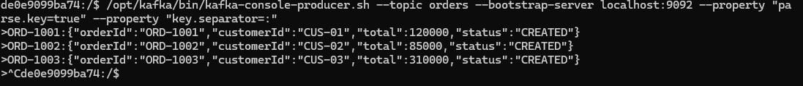

**Topic `payments`:**

```
/opt/kafka/bin/kafka-console-producer.sh --topic payments \
  --bootstrap-server localhost:9092 \
  --property "parse.key=true" --property "key.separator=:"
```

```
ORD-1001:{"paymentId":"PAY-001","orderId":"ORD-1001","total":120000,"status":"APPROVED"}
ORD-1002:{"paymentId":"PAY-002","orderId":"ORD-1002","total":85000,"status":"APPROVED"}
ORD-1003:{"paymentId":"PAY-003","orderId":"ORD-1003","total":310000,"status":"REJECTED"}
```

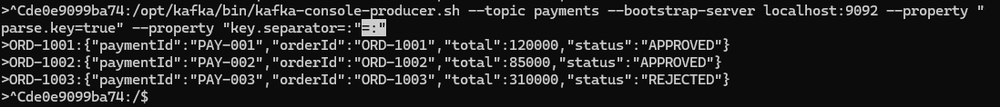

### Consumir y verificar por consola

```
/opt/kafka/bin/kafka-console-consumer.sh --topic orders \
  --bootstrap-server localhost:9092 --from-beginning \
  --property print.key=true \
  --property print.partition=true \
  --property print.offset=true
```

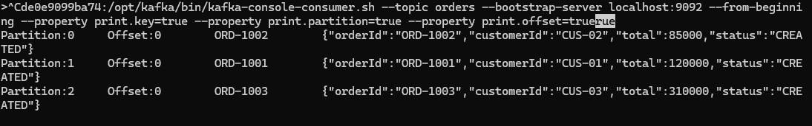

### Verificación en Kafka UI


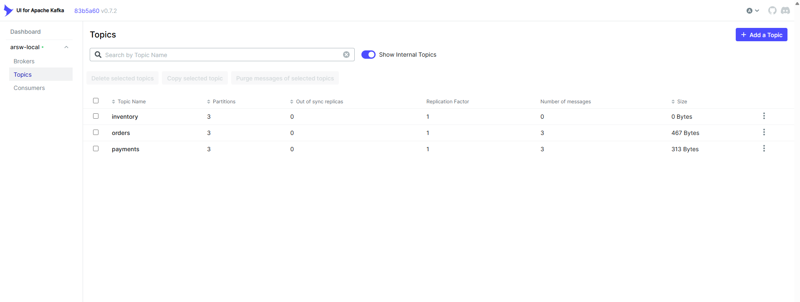

### Observaciones

- Los mensajes con la misma clave (`orderId`) siempre se enrutan a la misma partición, garantizando orden por pedido.
- El topic `inventory` queda vacío por ahora; será utilizado en capítulos posteriores cuando el `inventory-service` consuma eventos de `orders` y publique su respuesta.
- Con un solo broker (`replication-factor 1`) el entorno es funcional para laboratorio pero no tolerante a fallos, como se analizó en la Actividad 2.

---

## Actividad 4 — Trazabilidad del evento (Cap. 4)

> Documente el recorrido del evento desde la solicitud HTTP hasta el consumidor. Indique topic, clave, partición,
> consumidor, Consumer Group y evidencia en Kafka UI.

### Componentes involucrados

| Componente | Clase | Responsabilidad |
|------------|-------|------------------|
| Endpoint REST | `OrderController` | Recibe la solicitud HTTP y construye el evento de dominio. |
| Evento de dominio | `OrderCreatedEvent` | Representa el hecho `order-created` (orderId, customerId, total, status, occurredAt). |
| Productor | `OrderEventProducer` | Publica el evento en el topic `orders` usando `orderId` como clave. |
| Topic | `orders` | Configurado con 3 particiones y factor de replicación 1 (`KafkaTopicConfig`). |
| Consumidor | `OrderEventConsumer` | Escucha el topic `orders` dentro del Consumer Group `inventory-service`. |

### Recorrido del evento

1. **Solicitud HTTP**: el cliente envía `POST /orders` con `customerId` y `total` en el body.
2. **Controller**: `OrderController.createOrder()` recibe el `CreateOrderRequest`, genera un `orderId` único (`"ORD-" + UUID.randomUUID()`) y construye el `OrderCreatedEvent` con estado `CREATED`.
3. **Producer**: `OrderEventProducer.publishOrderCreated(event)` invoca `kafkaTemplate.send("orders", event.getOrderId(), event)`, publicando el evento en el topic `orders` con `orderId` como clave de partición.
4. **Broker**: Kafka calcula la partición mediante `hash(orderId) % 3` (el topic tiene 3 particiones) y almacena el evento en el offset correspondiente. Todos los eventos de un mismo `orderId` quedarán siempre en la misma partición.
5. **Consumer**: `OrderEventConsumer`, registrado con `@KafkaListener(topics = "orders", groupId = "inventory-service")`, recibe el evento y lo imprime en consola: `Evento recibido en inventory-service: <orderId>`.

### Detalle de trazabilidad

| Atributo | Valor |
|----------|-------|
| Topic | `orders` |
| Clave (key) | `orderId` (ej. `ORD-3f2a1c9e-...`) |
| Partición | Determinada por `hash(orderId) % 3` |
| Consumer | `OrderEventConsumer.consume()` |
| Consumer Group | `inventory-service` |
| Serialización | `JsonSerializer` (producer) / `JsonDeserializer` (consumer) |

### Prueba

```bash
curl -X POST http://localhost:8081/orders \
  -H "Content-Type: application/json" \
  -d '{"customerId":"CUS-01","total":120000}'
```

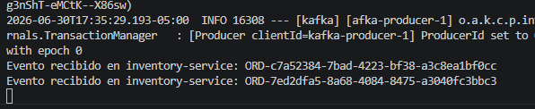

### Evidencia en Kafka UI

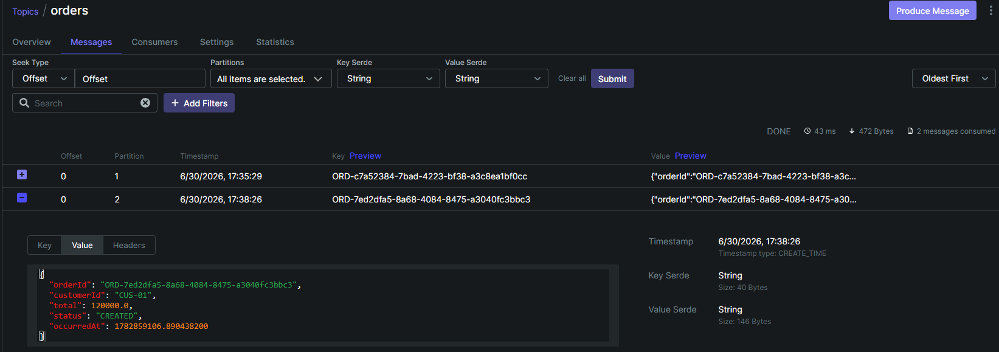

### Observaciones

- El `orderId` como clave garantiza que, si en el futuro se agregan más eventos relacionados al mismo pedido (pagos, inventario), todos lleguen a la misma partición y se procesen en orden.
- El Consumer Group `inventory-service` es independiente del `group-id` por defecto (`order-service`) definido en `application.yml`; el `groupId` del `@KafkaListener` tiene prioridad y permite que distintos servicios lógicos consuman el mismo topic sin competir por las particiones.
- Toda la trayectoria (HTTP → Controller → Producer → Broker → Consumer) es la materialización práctica del flujo conceptual descrito en el Capítulo 1: el productor publica y continúa, sin conocer ni esperar al consumidor.

---

## Actividad 5 — Diseño del flujo (Cap. 5)

> Proponga los eventos, topics, productores, consumidores, Consumer Groups y claves de particionamiento para el 
> flujo de compra. Justifique por qué no conviene usar un único topic global llamado events. 

### Eventos propuestos

| Evento | Servicio productor | Servicios consumidores |
|---------|--------------------|-------------------------|
| `order-created` | Order Service | Payment Service, Inventory Service, Analytics Service, Audit Service |
| `order-cancelled` | Order Service | Notification Service, Analytics Service, Audit Service |
| `payment-approved` | Payment Service | Invoice Service, Notification Service, Analytics Service, Audit Service |
| `payment-rejected` | Payment Service | Notification Service, Analytics Service, Audit Service |
| `inventory-reserved` | Inventory Service | Notification Service, Analytics Service, Audit Service |
| `inventory-rejected` | Inventory Service | Notification Service, Analytics Service, Audit Service |
| `invoice-generated` | Invoice Service | Notification Service, Analytics Service, Audit Service |
| `invoice-failed` | Invoice Service | Notification Service, Analytics Service, Audit Service |
| `notification-sent` | Notification Service | Analytics Service, Audit Service |
| `notification-failed` | Notification Service | Audit Service |


### Topics propuestos

| Topic | Eventos principales | Clave de particionamiento |
|--------|---------------------|---------------------------|
| `orders` | `order-created`, `order-cancelled` | `orderId` |
| `payments` | `payment-approved`, `payment-rejected` | `orderId` |
| `inventory` | `inventory-reserved`, `inventory-rejected` | `orderId` |
| `invoices` | `invoice-generated`, `invoice-failed` | `orderId` |
| `notifications` | `notification-sent`, `notification-failed` | `orderId` |
| `audit` | `audit-record-created` | `correlationId` |


### Productores

| Servicio | Topic donde publica |
|----------|----------------------|
| Order Service | `orders` |
| Payment Service | `payments` |
| Inventory Service | `inventory` |
| Invoice Service | `invoices` |
| Notification Service | `notifications` |
| Audit Service | `audit` |


### Consumidores

| Servicio | Topics que consume | Consumer Group |
|----------|--------------------| ----------------|
| Payment Service | `orders` | `payment-service` |
| Inventory Service | `orders` | `inventory-service` |
| Invoice Service | `payments` | `invoice-service` |
| Notification Service | `payments`, `inventory`, `invoices` | `notification-service` |
| Analytics Service | `orders`, `payments`, `inventory`, `invoices`, `notifications` | `analytics-service` |
| Audit Service | `orders`, `payments`, `inventory`, `invoices`, `notifications` (todos los topics de negocio, no su propio topic de salida `audit`) | `audit-service` |

Cada microservicio pertenece a un Consumer Group diferente para que todos reciban una copia independiente de los eventos. Los nombres de grupo coinciden con los usados en la implementación del Cap. 4 (`groupId = "inventory-service"`) y con los que propone el Cap. 6 del laboratorio (`payment-service`, `inventory-service`), manteniendo consistencia entre el diseño documentado y el código.


### Claves de particionamiento
**`orderId`** para los topics:
  - `orders`
  - `payments`
  - `inventory`
  - `invoices`
  - `notifications`


**`correlationId`** para el topic `audit`.


### ¿Por qué no conviene usar un único topic llamado `events`?

No es recomendable utilizar un único topic global porque:

- Mezcla eventos de distintos dominios, dificultando su organización.
- Los consumidores tendrían que leer y filtrar muchos eventos que no necesitan.
- Reduce el rendimiento al procesar información innecesaria.
- Complica el mantenimiento y la evolución del sistema.
- Limita la posibilidad de configurar particiones, retención y permisos específicos para cada tipo de evento.
- Incrementa el acoplamiento entre los microservicios.

Por estas razones, es una mejor práctica separar los eventos en topics específicos (`orders`, `payments`, `inventory`, `invoices`, `notifications` y `audit`), lo que mejora la escalabilidad, el rendimiento y la mantenibilidad del sistema.

---

## Actividad 6 — Evidencia y análisis (Cap. 6)

> Cree pedidos con valores diferentes y reconstruya el flujo de eventos en Kafka UI. Identifique eventos generados,
> topics, claves, Consumer Groups, offsets y lag.

Vamos a extender la aplicación para que el evento `order-created` (topic `orders`) desencadene, sin acoplamiento directo, dos nuevos eventos: uno de pago (`payments`) y uno de inventario (`inventory`). Cada uno es publicado por un consumer distinto que escucha `orders` desde su propio Consumer Group.

### Cambios respecto al Cap. 4

| Cambio | Detalle |
|--------|---------|
| Renombrado | `OrderEventConsumer` → `InventoryServiceConsumer`. Mismo `groupId` (`inventory-service`) y mismo `println` del Cap. 4, ahora extendido para publicar también un `InventoryProcessedEvent`. |
| Nuevo consumer | `PaymentServiceConsumer`, con `groupId = "payment-service"`, escucha `orders` de forma independiente y publica `PaymentProcessedEvent`. |
| Nuevos productores | `PaymentEventProducer` (publica en `payments`) e `InventoryEventProducer` (publica en `inventory`), siguiendo el mismo patrón que `OrderEventProducer`. |
| Nuevos DTOs | `PaymentProcessedEvent` (`paymentId`, `orderId`, `customerId`, `total`, `status`, `occurredAt`) e `InventoryProcessedEvent` (`inventoryId`, `orderId`, `customerId`, `status`, `occurredAt`). |

`payment-service` e `inventory-service` son grupos distintos, así que **ambos reciben una copia completa** de cada evento `order-created` — no compiten por las particiones entre sí, solo compiten consigo mismos si se escalan varias instancias del mismo servicio.

### Reglas de negocio (simuladas)

| Servicio | Condición | Resultado |
|----------|-----------|-----------|
| Payment Service | `total <= 250000` | `APPROVED`, si no `REJECTED` |
| Inventory Service | `total <= 300000` | `RESERVED`, si no `REJECTED` |

### Escenarios de prueba sugeridos

| Total | Pago esperado | Inventario esperado |
|-------|----------------|----------------------|
| `200000` | APPROVED | RESERVED |
| `280000` | REJECTED | RESERVED |
| `350000` | REJECTED | REJECTED |

### Comandos de prueba (PowerShell)

```powershell
curl.exe -X POST http://localhost:8081/orders -H "Content-Type: application/json" -d "{\"customerId\":\"CUS-01\",\"total\":200000}"
curl.exe -X POST http://localhost:8081/orders -H "Content-Type: application/json" -d "{\"customerId\":\"CUS-02\",\"total\":280000}"
curl.exe -X POST http://localhost:8081/orders -H "Content-Type: application/json" -d "{\"customerId\":\"CUS-03\",\"total\":350000}"
```

### Evidencia en consola

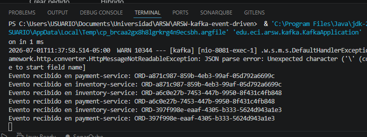

### Evidencia en Kafka UI — topic `payments`

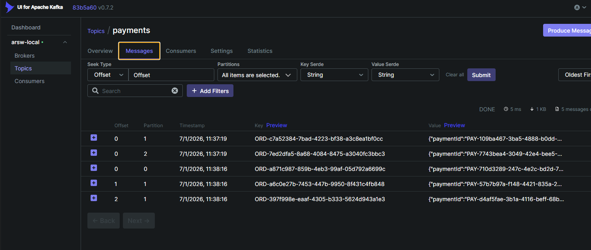

### Evidencia en Kafka UI — topic `inventory`

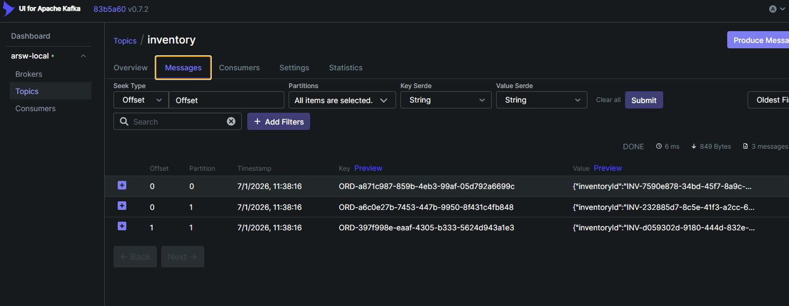

### Evidencia en Kafka UI — Consumer Groups

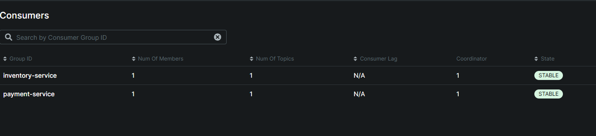

### Observaciones

- Cada `orderId` es la clave tanto en `orders` como en `payments` e `inventory`, por lo que los tres eventos de un mismo pedido quedan trazables entre topics aunque residan en particiones numeradas igual solo por coincidencia de hash, no por diseño compartido.
- `payment-service` e `inventory-service` procesan el **mismo** evento `order-created` de forma totalmente independiente y en paralelo: ninguno depende del resultado del otro, lo que evidencia el bajo acoplamiento de la arquitectura orientada por eventos.
- El lag de cada Consumer Group en Kafka UI debería mantenerse en 0 poco después de publicar cada pedido, ya que ambos consumers procesan casi instantáneamente. Un lag creciente indicaría que el consumer no está manteniendo el ritmo del productor.

---

## Actividad 7 — Estrategia de errores (Cap. 7)

> Diseñe una estrategia para manejar eventos fallidos en inventory-service. Indique cuándo reintentar, cuándo enviar
> a DLT, qué información revisar y cómo evitar reprocesamientos infinitos.

### Tipos de error identificados en `inventory-service`

| Tipo | Ejemplo concreto en este proyecto | Estrategia |
|------|-----------------------------------|------------|
| Transitorio | `InventoryEventProducer.publish()` falla al enviar a `inventory` por una caída momentánea del broker o timeout de red. | Reintentar con backoff fijo (3 intentos, 2 s entre cada uno). |
| Permanente | Un mensaje en `orders` sin cabecera de tipo o con JSON incompatible con `OrderCreatedEvent` — exactamente el caso de los eventos `ORD-1001`, `ORD-1002`, `ORD-1003` publicados manualmente en la Actividad 3 con `kafka-console-producer`, sin pasar por `JsonSerializer`. | Enviar directo a DLT **sin reintentar**: el mensaje nunca va a deserializar bien, reintentar solo agrega latencia innecesaria. |
| Negocio | `total` inválido o ausente al evaluar si el pedido se reserva. | No es un error técnico: se publica igual un `InventoryProcessedEvent` con `status = "REJECTED"`. No debe ir a DLT. |
| Técnico | Excepción no controlada dentro de `consume()` (ej. `NullPointerException` si `customerId` llega nulo). | Reintentar con backoff; si persiste tras los 3 intentos, enviar a DLT. |

### Cuándo reintentar vs. cuándo enviar directo a DLT

- **Reintentar** cuando el error puede resolverse solo con el tiempo (problema transitorio de red, broker temporalmente no disponible, excepción técnica no determinística).
- **Enviar directo a DLT sin reintentar** cuando el error es determinístico: el mismo mensaje va a fallar siempre de la misma forma (errores de deserialización, contrato de evento incompatible). Reintentar en estos casos no cambia el resultado y solo retrasa que el problema se detecte.

### Implementación

**`application.yml`** — se envuelven los deserializadores con `ErrorHandlingDeserializer` para que los errores de deserialización lleguen al manejador de errores en vez de interrumpir el hilo del consumer:

```yaml
consumer:
  group-id: order-service
  auto-offset-reset: earliest
  key-deserializer: org.springframework.kafka.support.serializer.ErrorHandlingDeserializer
  value-deserializer: org.springframework.kafka.support.serializer.ErrorHandlingDeserializer
  properties:
    spring.deserializer.key.delegate.class: org.apache.kafka.common.serialization.StringDeserializer
    spring.deserializer.value.delegate.class: org.springframework.kafka.support.serializer.JsonDeserializer
    spring.json.trusted.packages: "edu.eci.arsw.kafka.dto"
```

**`KafkaErrorHandlingConfig.java`** (nuevo) — define el `DefaultErrorHandler` compartido por todos los `@KafkaListener` del proyecto:

```java
@Configuration
public class KafkaErrorHandlingConfig {

    @Bean
    public DefaultErrorHandler errorHandler(KafkaTemplate<Object, Object> kafkaTemplate) {
        DeadLetterPublishingRecoverer recoverer = new DeadLetterPublishingRecoverer(kafkaTemplate,
                (record, exception) -> new TopicPartition(record.topic() + ".DLT", record.partition()));

        FixedBackOff backOff = new FixedBackOff(2000L, 3L);
        DefaultErrorHandler errorHandler = new DefaultErrorHandler(recoverer, backOff);

        errorHandler.addNotRetryableExceptions(DeserializationException.class);

        return errorHandler;
    }
}
```

Esta configuración aplica automáticamente a `InventoryServiceConsumer` y a `PaymentServiceConsumer`, ya que Spring Boot conecta el único bean `DefaultErrorHandler` del contexto al `ConcurrentKafkaListenerContainerFactory` por defecto.

### Qué información revisar en un mensaje de `orders.DLT`

Spring agrega automáticamente cabeceras de diagnóstico a cada mensaje publicado en el DLT:

| Cabecera | Información que aporta |
|----------|-------------------------|
| `kafka_dlt-exception-message` | Mensaje de la excepción que causó el fallo. |
| `kafka_dlt-exception-stacktrace` | Stacktrace completo para depuración. |
| `kafka_dlt-original-topic` | Topic original del mensaje (`orders`). |
| `kafka_dlt-original-partition` / `kafka_dlt-original-offset` | Ubicación exacta del mensaje que falló, para poder correlacionarlo con el topic original. |
| Value (payload crudo) | El contenido del mensaje tal como llegó, para saber si el problema fue del productor o del contrato del evento. |

### Cómo evitar reprocesamientos infinitos

- El `FixedBackOff(2000L, 3L)` limita los reintentos a 3; agotados, el `DeadLetterPublishingRecoverer` publica en el DLT **y confirma (commit) el offset original**, por lo que el consumer avanza y no se queda atascado repitiendo el mismo mensaje.
- Los errores de deserialización se marcan como no reintentables (`addNotRetryableExceptions`), evitando gastar los 3 intentos en un error que nunca se va a resolver solo.
- Un mensaje en `orders.DLT` **no vuelve automáticamente** a `orders`: cualquier reproceso requiere una acción explícita (revisión manual o un job de reintento aparte), evitando que un evento problemático entre en un ciclo automático de reintentos infinitos entre topics.

### Idempotencia (a futuro)

Actualmente `InventoryServiceConsumer` no verifica si un `orderId` ya fue procesado antes de publicar su `InventoryProcessedEvent`. Si Kafka reentrega un mensaje (ej. tras un rebalanceo o un reinicio antes de confirmar el offset), se publicaría un evento de inventario duplicado. Para un entorno productivo, la mejora natural es que `inventory-service` registre los `orderId` ya procesados (tabla de eventos procesados o restricción única) y descarte los duplicados antes de publicar, en línea con lo descrito en la sección 7.4 del laboratorio.

---

## Actividad 8 — Diagnóstico de buenas prácticas (Cap. 8)

> Revise una arquitectura que usa un topic `events`, mensajes sin clave, factor de replicación 1, sin DLT y sin
> monitoreo de lag. Identifique problemas, atributos afectados y mejoras prioritarias.

### Configuración analizada

| Parámetro | Valor actual |
|-----------|--------------|
| Topic | `events` (único, global para todo el dominio) |
| Clave de mensaje | Ninguna |
| Factor de replicación | 1 |
| Dead Letter Topic | No configurado |
| Monitoreo de lag | No configurado |

### Problemas identificados

| Parámetro | Problema | Atributo afectado |
|-----------|----------|--------------------|
| Topic único `events` | Mezcla eventos de dominios distintos (pedidos, pagos, inventario, notificaciones, auditoría) en un mismo topic. Cada consumidor debe leer y descartar mensajes que no le interesan, y no es posible aplicar retención, particiones o permisos diferenciados por tipo de evento (mismo problema que se justificó evitar en la Actividad 5). | Mantenibilidad / Escalabilidad / Rendimiento |
| Sin clave de mensaje | Los eventos se distribuyen round-robin entre particiones. Eventos relacionados de un mismo `orderId` pueden terminar en particiones distintas, rompiendo su orden relativo. | Consistencia |
| Factor de replicación 1 | Si el único broker falla, se pierden permanentemente todos los eventos del topic; no hay ISR de respaldo. | Disponibilidad / Durabilidad |
| Sin Dead Letter Topic | Un evento que falla de forma permanente (ej. error de deserialización) no tiene a dónde ir: según cómo esté configurado el consumer, se pierde silenciosamente o bloquea el procesamiento del resto de mensajes de esa partición. | Confiabilidad |
| Sin monitoreo de lag | No hay forma de detectar que un consumer se está quedando atrás o dejó de procesar hasta que el impacto de negocio ya es visible (ej. pagos sin confirmar). | Observabilidad |

### Riesgos para producción

- **Pérdida total de datos** ante la caída del único broker (replicación 1), sin posibilidad de recuperación.
- **Eventos desordenados** entre servicios que dependen de la secuencia correcta (ej. `order-created` antes que `payment-approved` para el mismo pedido).
- **Fallos silenciosos**: sin DLT, un evento problemático puede perderse sin que nadie se entere, o bloquear indefinidamente el procesamiento de una partición completa.
- **Incidentes detectados tarde**: sin monitoreo de lag, un consumer caído o lento se descubre solo cuando el negocio ya sufrió el impacto (pedidos sin procesar, notificaciones no enviadas).
- **Acoplamiento accidental** entre dominios: un cambio en el formato de un evento de un dominio (ej. `payment-approved`) puede romper consumidores de otros dominios que comparten el mismo topic `events` sin necesitarlo.

### Cambios prioritarios (de mayor a menor impacto)

1. **Separar `events` en topics por dominio** (`orders`, `payments`, `inventory`, etc.), como se definió en la Actividad 5 — es el cambio de mayor impacto arquitectónico, ya que habilita el resto de mejoras (retención, particiones y permisos por topic).
2. **Aumentar el factor de replicación** a 3 (con `min.insync.replicas=2`) — evita pérdida de datos ante fallo de un broker.
3. **Definir clave de particionamiento** coherente por entidad (`orderId`, `correlationId`) — garantiza orden por pedido.
4. **Configurar DLT y reintentos con backoff** (como se implementó en la Actividad 7) — evita pérdidas silenciosas y bloqueos indefinidos.
5. **Agregar monitoreo de lag** (Kafka UI, métricas expuestas a un sistema de alertas) — permite detectar consumidores caídos o lentos antes de que impacten al negocio.

### Propuesta de mejora resumida

| Parámetro | Valor actual | Valor propuesto | Justificación |
|-----------|---------------|------------------|----------------|
| Topics | `events` (único) | `orders`, `payments`, `inventory`, `invoices`, `notifications`, `audit` | Aísla dominios, permite configuración independiente por topic. |
| Clave de mensaje | Ninguna | `orderId` / `correlationId` según el topic | Preserva el orden de eventos relacionados. |
| Factor de replicación | 1 | 3 | Tolera la caída de hasta 2 brokers sin pérdida de datos. |
| Manejo de errores | Sin DLT | `DefaultErrorHandler` + `DeadLetterPublishingRecoverer` | Evita pérdidas silenciosas y bloqueos indefinidos del consumer. |
| Observabilidad | Sin monitoreo de lag | Dashboard de Kafka UI + alertas sobre `Consumer Lag` | Detecta consumidores caídos o lentos de forma temprana. |

### Conclusión

Esta configuración es funcional solo para un prototipo de un único desarrollador en un entorno controlado. Para producción, el problema de mayor impacto es el topic único `events`, ya que condiciona negativamente casi todos los demás atributos de calidad (mantenibilidad, escalabilidad, consistencia); por eso es el primer cambio a priorizar. Los demás ajustes (replicación, clave, DLT y observabilidad) son los mismos que ya se justificaron y, en el caso de replicación y DLT, ya se implementaron en las Actividades 2 y 7 de este mismo proyecto.

---

## Actividad 9.1 — Decisiones de comunicación (Cap. 9)

> Clasifique los siguientes procesos como REST, Kafka o arquitectura híbrida para una tienda en línea.
> Justificación basada en: respuesta inmediata, asincronía, múltiples consumidores y reprocesamiento.

| Proceso                    | Mecanismo     | Justificación |
|----------------------------|---------------|---------------|
| Consultar catálogo         | REST          | Requiere respuesta inmediata al usuario. No hay asincronía ni múltiples consumidores involucrados. |
| Crear pedido               | Híbrido       | El cliente necesita confirmación inmediata (REST), pero la creación dispara eventos `order-created` hacia payment-service, inventory-service y notification-service (Kafka). |
| Validar pago               | Híbrido       | La llamada al gateway de pago puede ser síncrona (REST), pero el resultado (`payment-approved` / `payment-rejected`) se publica en Kafka para que invoice-service, notification-service y audit-service lo consuman de forma independiente. |
| Enviar notificación        | Kafka         | No requiere respuesta inmediata. Es un proceso asíncrono de bajo acoplamiento; múltiples canales (correo, push, SMS) pueden consumir el mismo evento desde grupos distintos. |
| Actualizar analítica       | Kafka         | La analítica no requiere respuesta inmediata. Kafka permite alto volumen de eventos, múltiples consumidores y reprocesamiento histórico sin impacto en el flujo principal. |
| Registrar auditoría        | Kafka         | La auditoría es asíncrona por naturaleza. Permite reprocesamiento ante fallos, múltiples consumidores y no debe bloquear el flujo de negocio. |
| Consultar estado del pedido| REST          | El usuario espera una respuesta inmediata. La consulta es puntual y no genera efectos secundarios. |
| Actualizar inventario      | Híbrido       | El inventory-service reacciona de forma asíncrona al evento `order-created` (Kafka), pero la validación de disponibilidad de stock puede requerir una consulta síncrona interna antes de publicar `inventory-reserved` o `inventory-rejected`. |

### Conclusión

En una tienda en línea, la arquitectura óptima combina REST y Kafka según la naturaleza de cada proceso:

- **REST** para procesos que requieren respuesta inmediata al usuario (consultas, confirmaciones).
- **Kafka** para procesos asíncronos que no necesitan respuesta inmediata, que involucran múltiples consumidores o que se benefician del reprocesamiento (notificaciones, analítica, auditoría).
- **Híbrido** para procesos de negocio core como crear pedidos, validar pagos y actualizar inventario, donde el punto de entrada es síncrono pero las consecuencias se propagan de forma asíncrona mediante eventos.

---

## Actividad 9.2 — Diseño del flujo de eventos (Cap. 9)

> Diseñe el flujo de eventos para el proceso de compra. Incluya eventos principales, productor, consumidores, topic,
> clave de particionamiento y Consumer Group. Responda por qué no conviene un único topic `events`, por qué los
> consumidores deben tener grupos distintos y por qué `orderId` puede ser una buena clave.

El diseño completo (tabla de eventos, topics, productores, consumidores y claves) ya se desarrolló en la **Actividad 5** y se implementó de forma parcial en el **Cap. 6** (`orders` → `payment-service` / `inventory-service`). Esta actividad se enfoca en justificar las tres decisiones de diseño puntuales que pide el enunciado.

### ¿Por qué no conviene un único topic `events`?

Mismo argumento que en la Actividad 5: mezclar todos los dominios en un topic global obliga a cada consumidor a filtrar eventos que no le interesan, impide configurar retención/particiones/permisos por tipo de evento, y acopla accidentalmente servicios que no deberían depender entre sí (un cambio de esquema en un evento de pagos podría romper un consumidor de inventario que comparte el mismo topic sin necesitarlo).

### ¿Por qué los consumidores deben tener Consumer Groups distintos?

Porque dentro de un mismo Consumer Group, Kafka reparte las particiones de un topic entre sus miembros — **no** duplica el mensaje a cada uno. Si `payment-service` e `inventory-service` compartieran el mismo `groupId`, cada evento `order-created` lo procesaría **solo uno de los dos**, nunca ambos, y cuál de ellos lo procese dependería de a qué partición quedó asignado cada consumer.

Esto no es teórico: lo comprobamos directamente en este proyecto durante el Cap. 6. Al extender el consumer de inventario, en un punto intermedio quedaron dos clases (`OrderEventConsumer` y una nueva) escuchando `orders` con el mismo `groupId = "inventory-service"`; de haberse desplegado así, las 3 particiones se habrían repartido entre ambas instancias y ningún pedido habría sido procesado por las dos lógicas a la vez. La solución fue la misma que exige esta actividad: cada servicio lógico necesita su **propio** Consumer Group (`payment-service`, `inventory-service`) para que **todos** reciban una copia completa de cada evento `order-created`, de forma independiente y sin competir por particiones.

### ¿Por qué `orderId` puede ser una buena clave?

Porque es el identificador de la entidad cuyo orden importa: todos los eventos relacionados con un mismo pedido (`order-created`, `payment-approved`/`rejected`, `inventory-reserved`/`rejected`) deben procesarse en el orden en que ocurrieron para ese pedido específico. Kafka solo garantiza orden **dentro de una partición**, y el particionamiento por defecto usa `hash(key) % numPartitions`; al usar `orderId` como clave, todos los eventos de un mismo pedido —incluso en topics distintos como `orders`, `payments` e `inventory`— son deterministas en qué partición caen dentro de su topic, evitando que una carrera entre particiones desordene el procesamiento de un mismo pedido.

---

## Actividad 9.3 — Diagnóstico arquitectónico (Cap. 9)

> Configuración propuesta: topic principal `events`, 1 partición, factor de replicación 1, retención 12 horas,
> mensajes sin clave, sin `eventId`, sin `correlationId`, todos los consumidores en el mismo Consumer Group,
> sin Dead Letter Topics y sin monitoreo de lag. Realice un diagnóstico técnico breve.

### Problemas identificados

| Parámetro | Problema | Atributo afectado |
|-----------|----------|--------------------|
| Topic único `events` | Mezcla todos los dominios de negocio; ya justificado en la Actividad 5/9.2. | Mantenibilidad / Escalabilidad |
| 1 partición | Un único Consumer Group solo puede paralelizar hasta 1 consumer activo por partición; con 1 partición no hay paralelismo posible, sin importar cuántas instancias se desplieguen. | Escalabilidad |
| Factor de replicación 1 | Pérdida total de datos si el único broker falla. | Disponibilidad / Durabilidad |
| Retención 12 horas | Ventana de recuperación muy corta; un incidente que dure más de medio día hace irrecuperables los eventos no procesados. | Confiabilidad / Trazabilidad |
| Sin clave | Sin orden garantizado entre eventos de una misma entidad (ver 9.2). | Consistencia |
| Sin `eventId` | Imposible detectar si un evento ya fue procesado; no hay forma de implementar idempotencia ni de deduplicar tras un reintento o una reentrega de Kafka. | Confiabilidad |
| Sin `correlationId` | Imposible trazar todos los eventos derivados de una misma operación de negocio a través de distintos topics/servicios (ej. para auditoría o debugging de un incidente). | Observabilidad / Trazabilidad |
| **Todos los consumidores en el mismo Consumer Group** | El más grave: como se explicó en la 9.2, un mismo Consumer Group reparte particiones entre sus miembros, no duplica eventos. Si todos los servicios (pagos, inventario, notificaciones, analítica, auditoría) comparten grupo, **cada evento lo procesa solo un servicio al azar**, no todos los que lo necesitan. El sistema dejaría de funcionar silenciosamente para la mayoría de los servicios. | Correctitud funcional / Confiabilidad |
| Sin DLT | Eventos con error permanente se pierden o bloquean el consumer, sin diagnóstico posible (ver Actividad 7). | Confiabilidad |
| Sin monitoreo de lag | Consumidores caídos o lentos se detectan solo cuando el negocio ya sufrió el impacto. | Observabilidad |

### Riesgos para producción

- **El sistema parecería funcionar en pruebas con un solo consumer activo, pero fallaría en producción** apenas se desplegara más de un servicio lógico, porque el Consumer Group compartido haría que solo uno de ellos reciba cada evento — un bug muy difícil de detectar sin monitoreo de lag.
- Sin `eventId`, cualquier mecanismo de reintento (incluido el DLT recomendado en la Actividad 7) puede generar **duplicados** si el evento sí llegó a procesarse antes del reintento.
- Sin `correlationId`, un incidente de producción (ej. "el pedido X quedó en un estado inconsistente") es muy difícil de depurar, porque no hay forma de correlacionar los eventos de `events` que pertenecen a esa misma operación de negocio.
- Ventana de recuperación de solo 12 horas: cualquier mantenimiento de fin de semana o incidente prolongado deja eventos irrecuperables.

### Cambios prioritarios

1. **Separar el Consumer Group compartido** en uno por servicio — es el cambio más urgente, ya que sin esto el sistema no funciona correctamente para más de un consumidor, sin importar qué tan bien estén configurados los demás parámetros.
2. **Separar `events` en topics por dominio** y aumentar particiones según el paralelismo requerido.
3. **Agregar `eventId` y `correlationId`** a los metadatos del evento (ver formato recomendado en el Cap. 8 del laboratorio) para habilitar idempotencia y trazabilidad.
4. **Aumentar factor de replicación** a 3 y retención a varios días, según necesidades de auditoría/reprocesamiento.
5. **Implementar DLT y monitoreo de lag**, como en las Actividades 7 y 8.

### Propuesta de mejora

| Parámetro | Valor actual | Valor propuesto |
|-----------|---------------|------------------|
| Topics | `events` (único) | Uno por dominio (`orders`, `payments`, `inventory`, ...) |
| Particiones | 1 | Según volumen y paralelismo esperado (ej. 3) |
| Factor de replicación | 1 | 3, con `min.insync.replicas=2` |
| Retención | 12 horas | Días, según necesidades de auditoría y reprocesamiento |
| Clave de mensaje | Ninguna | `orderId` / `correlationId` según el topic |
| Metadatos del evento | Sin `eventId` ni `correlationId` | Incluir ambos en cada evento |
| Consumer Groups | Uno compartido para todos los servicios | Uno por servicio lógico (`payment-service`, `inventory-service`, etc.) |
| Manejo de errores | Sin DLT | `DefaultErrorHandler` + DLT por topic |
| Observabilidad | Sin monitoreo de lag | Dashboard de lag + alertas |

### Conclusión

El problema de mayor severidad no es de rendimiento ni de configuración fina, sino de **corrección funcional**: compartir un único Consumer Group entre todos los consumidores rompe la premisa básica de una arquitectura orientada por eventos (que cada servicio interesado reciba su propia copia del evento). Ese cambio debe hacerse antes que cualquier otro, porque ninguna mejora de retención, replicación u observabilidad soluciona un sistema que, por diseño, solo entrega cada evento a un consumidor arbitrario en lugar de a todos los que lo necesitan.
